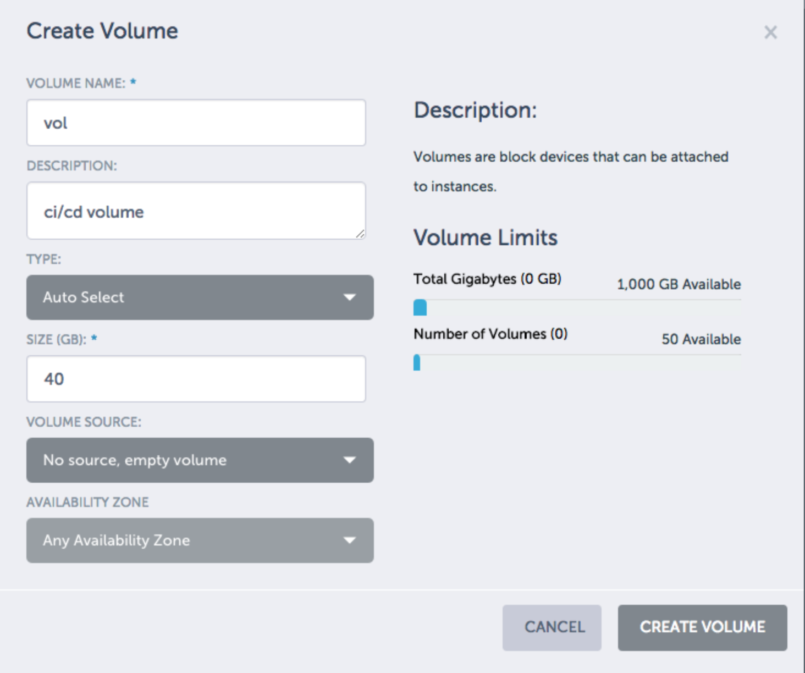
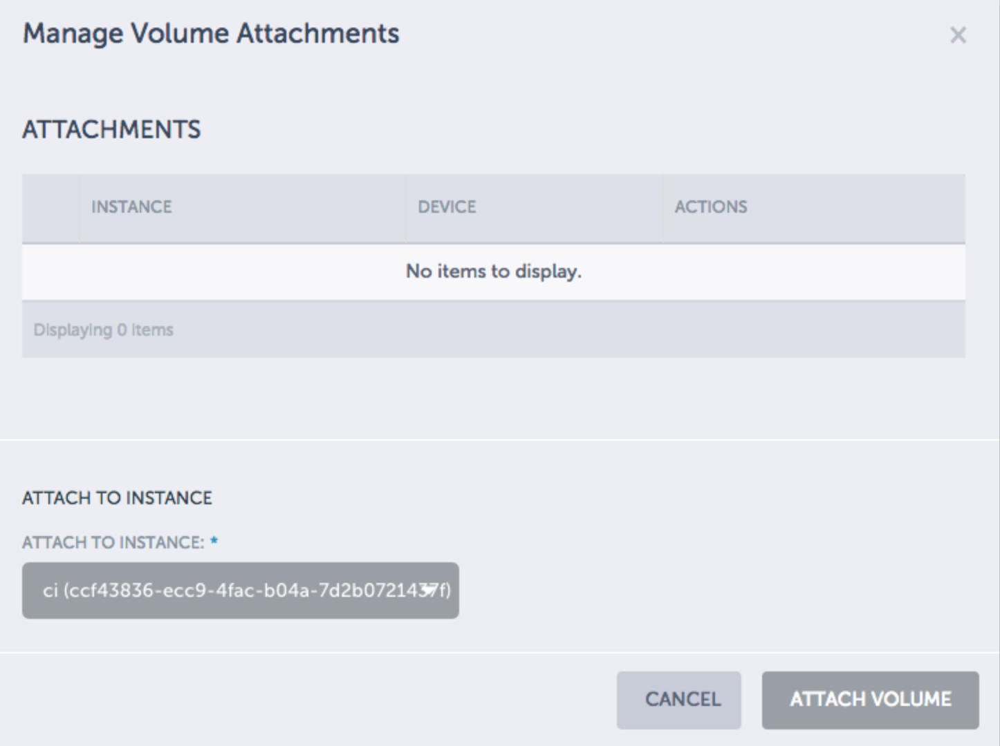

# Setup Lab Instructions

These are all the scripts for setting up the lab.  Mostly they
are Ansible playbooks to use against a metacloud lab environment. 

_All instructions assume you are using OSX as your workstation_

## 1. Get CoreOS image

Download the latest CoreOS image: 

### GUI approach
You can do this through the GUI if you have an extracted image somewhere.  Otherwise, you'll first have to download and extract the image and then use the GUI. 


### CLI approach

If you use the metapod Ubuntu 12.0 version to build this, log into it and then run: 
```
sudo apt-get update
sudo apt-get install qemu-utils
```

```
wget http://stable.release.core-os.net/amd64-usr/current/coreos_production_openstack_image.img.bz2
bunzip2 coreos_production_openstack_image.img.bz2
qemu-img convert -f qcow2 -O raw coreos*.img coreos.raw
```

With an ubuntu image, you can put it on a web server to serve it: 
```
sudo apt-get install nginx
sudo service nginx start
sudo mv coreos.raw /usr/share/nginx/www/
```

Create the image in OpenStack: 
```
glance image-create --name CoreOS \
  --container-format bare \
  --disk-format qcow2 \
  --file coreos_production_openstack_image.img \
  --is-public True
```

## 2. Allocate floating IP addresses

You will need 
* 1 IP address per 10 users
* 1 IP address for the CI/CD environment
* 1 IP address for the webserver that will run our code. 

__As an example: A class of 25 users would need 5 floating IP addresses.__

You'll need at least 3 security groups: 
* prod: ports 80, 22, 8001-8100
* cicd: 22, 8080, 10022, 10080
* default: 22, 80, 2222 (port 2222 is for the lab)

## 3. Packer

Now we are going to prep the image for jenkins.  To do this, we use Packer to create the image.  

### 3.1 Get the image ID of CoreOS

```
nova image-list | grep CoreOS | awk -F'|' '{print $2}'} | pbcopy
```
Take this and paste it into the ```./Packer/coreos-jenkins.json``` file in this repository after the ```source_image``` parameter. 

It should look something like:
```
  "source_image" : "6993e52b-84af-4ae7-80d9-20ca9c657761", 
```
_Note: Make sure to enclose the quotes and end with a comma.  This is javascript!_

### 3.2 Get the right flavor

Best to build it with a large image if you can: 
```
nova flavor-list
```
Get the ID for the m1.large and copy that to the packer file. 
```
  "flavor": "712abf46-5cb6-4cab-a2ad-b5415e6190dd"
```
_Note: No commas after this if its the last hash entry._ 

### 3.3 Get the Floating IP address

Modify the file with the correct floating IP address
```
  "floating_ip_pool": "nova",
```
I've had some clusters where this didn't work, so you may need to actually add an IP address.  So instead use something like: 
```
  "floating_ip": "38.84.67.209",
```
but change to be one of the floating IP addresses. 

### 3.4 Security Group

Make sure the default security group allows SSH

### 3.5 Build with Packer

Once all the changes are done, you should be able to launch your images: 
```
packer build coreos-jenkins.json
```

## 4.  Build lab machines

### 4.1 Update Environments files

In the Ansible directory there is a /vars/ file that has values that should be changed to 
match the environment you are in: 

```
keypair: t4
security_group: default
coreos_image: CoreOS766
m1large: 712abf46-5cb6-4cab-a2ad-b5415e6190dd
floating_ip_pool: "nova"
```

### 4.2 Update the Inventory File

In ./Ansible/inventory/openstack_inventory.py there is a line: 
```
OS_NETWORK_NAME = 'demo1-1017'
```
Change to be your network.  You can see this by running nova list and noting the network name of the instance. 

### 4.3 Update the keypair

In ./Ansible/inventory/hosts update the keypair to be the location of your keypair.  There are 2 places
to make this change. 

```
ansible_ssh_private_key_file = ~/.ssh/t4.pem
```

### 4.4 Run Ansible Playbook

```
ansible-playbook lab-machines.yml
```
This script can take a while as it installs an instance then downloads a container and runs it. 

### 4.5 Update the Security Group

Make sure the security group for the lab machine enables the following ports: 
* 22
* 2222

### 4.6 Make sure Docker is running

Log into the lab machine and ensure you can do a docker command: 
```
ssh -p 2222 user01@<ip address of lab server>
sudo docker ps
```
The password for all lab accounts is ```Cisco.123```

If that fails, restart it by logging into the machine (not port 2222) killing the docker image and then 
rerunning the ansible script: 
```
nova ssh -i ~/.ssh/<yourkey>.pem core@lab01
docker stop lab01
docker rm lab01
exit
ansible-playbook lab-machines.yml # this command from your laptop
```

This time, it shouldn't take as long to run. 

## 5. Lab Infrastructure

This is the part of the lab that hosts jenkins and gitlab. 

#### 5.1 Mount a volume. 

Ansible doesn't do this yet. Create a 40GB volume in the metapod window.



Comment out all the rules in the ```infra.yml``` flie and then run the program. 

This will create an instance.  While this is happening, mount the volume to the
instance. 




Once this is attached log into the server and create a filesystem on it. 
```
nova ssh -i ~/.ssh/t4.pem core@ci
sudo fdisk -l
sudo fdisk /dev/vdb
n
p
[enter]
[enter]
[enter]
w
exit
```

#### 5.2 Registry


Uncomment the filesystem and registry role in the ansible playbook and and re-run the playbook:
```
ansible-playbook infra.yml
```

Log back into the ci machine and make sure the registry is running.  If it is not remove the registry and rerun 
the ansible script. (Yes, I know this is horrible that you have to keep rerunning it.)


#### 5.3 Initial Registry Images. 

The infra.yml brings up a machine called ```ci```.  All the systems provisioned
in this lab are programmed to allow insecure docker communication to ```ci```. 

They expect several docker images to be there.  

Log back into the ci machine.  We will need to download some images and place them 
in the public repository.  The commands will need to do something like the below:

```
docker pull <image>
docker tag <image> ci:5000/<image>
docker push ci:5000/<image>
```

The images we need are:

* jenkins
* nginx
* sameersbn/redis
* sameersbn/postgresql
* sameersbn/gitlab

The following script will do this for you:
```
for i in jenkins nginx sameersbn/redis sameersbn/postgresql sameersbn/gitlab; 
do docker pull $i; 
docker tag $i ci:5000/$i; 
docker push ci:5000/$i; 
done
```

#### 5.4 Jenkins and Gitlab
Once completed, uncomment the rest of the roles in the infra.yml file and rerun 
```
ansible-playbook infra.yml
```
#### 5.5 Security Groups
Make sure you define a security group that allows for the following ports to be
accessible to the ci environment
* 22
* 10080
* 10022
* 8080

#### 5.6 Verify 

Verify that the jenkins and gitlab services are running.  Open a web browser to 
```
<ip of ci>:10080
```
and 
```
<ip of ci>:8080
```

The lab should now be ready to use.  We now need to customize Gitlab and Jenkins.  Follow the
directions [here](http://benincosa.com/?p=3352) 

### 6. Gitlab Configuration

Login as ```root``` with password ```5iveL!fe```  

You'll need to create a ```jenkins``` user.  The password of the jenkins user to gitlab should
be the same as the jenkins password to metapod. 

Log out as ```root``` and login as ```jenkins``` in the web interface. 

Create an SSH keypair for this ```jenkins``` user.  To generate this, go into the ci machine: 

```
nova ssh -i ~/.ssh/t4.pem core@ci
docker exec -it jenkins /bin/bash
ssh-keygen -t rsa
```
The keypair will be stored in ```/var/jenkins_home/.ssh/```

Copy the public key and paste it in the jenkins user account: 
```
cat /var/jenkins_home/.ssh/
```

Add this to the jenkins user.  

The last step to do for gitlab while logged in as the Jenkins user is to go to account settings and get the private
token from the __Account__ side bar.  Mine looks like:  ```VGsUsMEY-Pj93zEKFUmf```.  Copy this as we'll need it for 
jenkins. 

Now Gitlab is ready. 

### 7. Jenkins configuration


#### 7.1 enable security

Make sure passwords are required and allow for anybody to sign up.  

#### 7.2 Install plugins

These plugins will be the ones listed on the [blog](http://benincosa.com/?p=3352)
* Gitlab
* OpenStack Cloud Plugin 
* Docker Build and Publish
* Slack 
* SSH

#### 7.3 Configure Jenkins

Follow the direction in section 4 and 5 on the [blog](http://benincosa.com/?p=3352).  For security create 
a jenkins account and use the keys in the ~/.ssh directory.  You shouldn't have to put any keys in. 

You'll need to create a new image again with the jenkins ssh key using packer.  Edit the packer file and 
put in the correct ssh key so that jenkins can log into the slaves.  

Make sure you launch a slave and that it can connect to the slave.  

Make sure you create a jenkins User ID so that they can be the one that logs into the slaves. 
