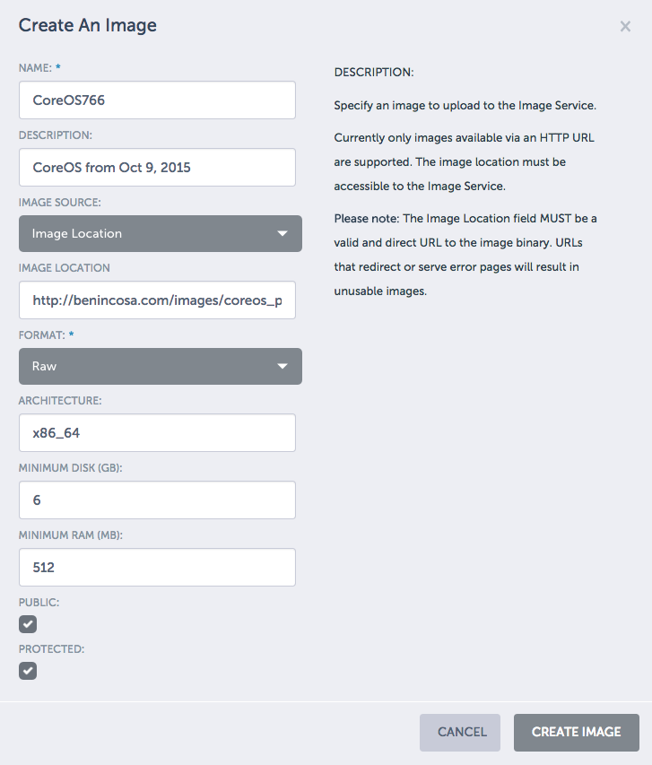

# Setup Lab Instructions

These are all the scripts for setting up the lab.  Mostly they
are Ansible playbooks to use against a metacloud lab environment. 

_All instructions assume you are using OSX as your workstation_

## 1. Get CoreOS image

Download the latest CoreOS image: 

### GUI approach
You can do this through the GUI if you have an extracted image somewhere.  Otherwise, you'll first have to download and extract the image and then use the GUI. 



### CLI approach

If you use the metapod Ubuntu 12.0 version to build this, log into it and then run: 
```
sudo apt-get update
sudo apt-get install qemu-utils
```

```
wget http://stable.release.core-os.net/amd64-usr/current/coreos_production_openstack_image.img.bz2
bunzip2 coreos_production_openstack_image.img.bz2
qemu-img convert -f qcow2 -O raw coreos*.img coreos.raw
```

With an ubuntu image, you can put it on a web server to serve it: 
```
sudo apt-get install nginx
sudo service nginx start
sudo mv coreos.raw /usr/share/nginx/www/
```

Create the image in OpenStack: 
```
glance image-create --name CoreOS \
  --container-format bare \
  --disk-format qcow2 \
  --file coreos_production_openstack_image.img \
  --is-public True
```

## 2. Allocate floating IP addresses

You will need 
* 1 IP address per 10 users
* 1 IP address for the CI/CD environment
* 1 IP address for the webserver that will run our code. 

__As an example: A class of 25 users would need 5 floating IP addresses.__


## 3. Packer

Now we are going to prep the image for jenkins.  To do this, we use Packer to create the image.  

### 3.1 Get the image ID of CoreOS

```
nova image-list | grep CoreOS | awk -F'|' '{print $2}'} | pbcopy
```
Take this and paste it into the ```./Packer/coreos-jenkins.json``` file in this repository after the ```source_image``` parameter. 

It should look something like:
```
  "source_image" : "6993e52b-84af-4ae7-80d9-20ca9c657761", 
```
_Note: Make sure to enclose the quotes and end with a comma.  This is javascript!_

### 3.2 Get the right flavor

Best to build it with a large image if you can: 
```
nova flavor-list
```
Get the ID for the m1.large and copy that to the packer file. 
```
  "flavor": "712abf46-5cb6-4cab-a2ad-b5415e6190dd"
```
_Note: No commas after this if its the last hash entry._ 

### 3.3 Get the Floating IP address

Modify the file with the correct floating IP address
```
  "floating_ip_pool": "nova",
```
I've had some clusters where this didn't work, so you may need to actually add an IP address.  So instead use something like: 
```
  "floating_ip": "38.84.67.209",
```
but change to be one of the floating IP addresses. 

### 3.4 Security Group

Make sure the default security group allows SSH

### 3.5 Build with Packer

Once all the changes are done, you should be able to launch your images: 
```
packer build coreos-jenkins.json
```

## 4.  Build lab machines

### 4.1 Update Environments files

In the Ansible directory there is a /vars/ file that has values that should be changed to 
match the environment you are in: 

```
keypair: t4
security_group: default
coreos_image: CoreOS766
m1large: 712abf46-5cb6-4cab-a2ad-b5415e6190dd
floating_ip_pool: "nova"
```

### 4.2 Update the Inventory File

In ./Ansible/inventory/openstack_inventory.py there is a line: 
```
OS_NETWORK_NAME = 'demo1-1017'
```
Change to be your network.  You can see this by running nova list and noting the network name of the instance. 

### 4.3 Update the keypair

In ./Ansible/inventory/hosts update the keypair to be the location of your keypair.  There are 2 places
to make this change. 

```
ansible_ssh_private_key_file = ~/.ssh/t4.pem
```

### 4.4 Run Ansible Playbook

```
ansible-playbook lab-machines.yml
```
This script can take a while as it installs an instance then downloads a container and runs it. 

### 4.5 Update the Security Group

Make sure the security group for the lab machine enables the following ports: 
* 22
* 2222

## Usage

The infra.yml requires some manual work while I wait for Ansible to 
fix their 2.0 stuff to work with metapod.  

* You have to create your own volume and mount it to the instance and
format it as well.  Doing an ```fdisk``` can make this happen.  

* Initial images need to be downloaded to the local registery (described below)

## Initial Registry Images. 

The infra.yml brings up a machine called ```ci```.  All the systems provisioned
in this lab are programmed to allow insecure docker communication to ```ci```. 

They expect several docker images to be there.  For each of the following
images you need to run: 

```
docker pull <image>
docker tag <image> ci:5000/<image>
docker push ci:5000/<image>
```

The images are: 

* jenkins
* nginx
* sameersbn/redis
* sameersbn/postgresql
* sameersbn/gitlab
