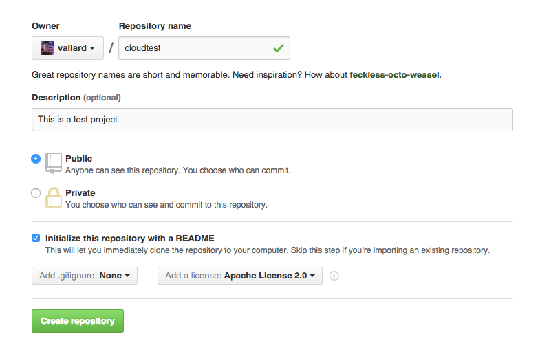
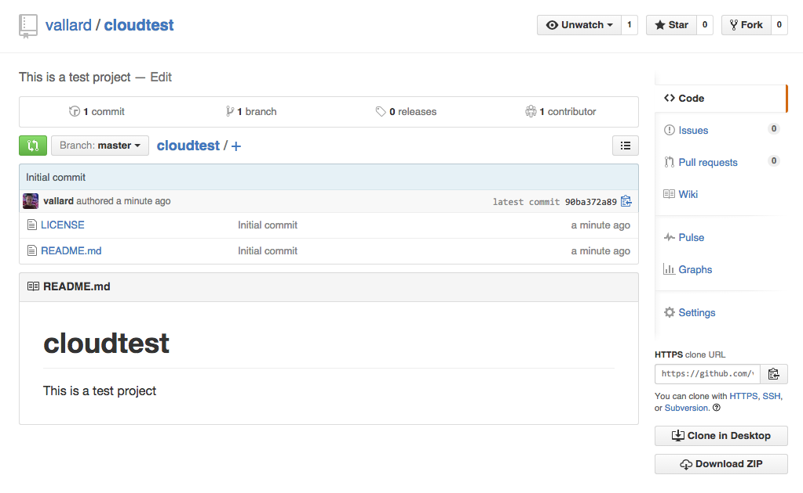
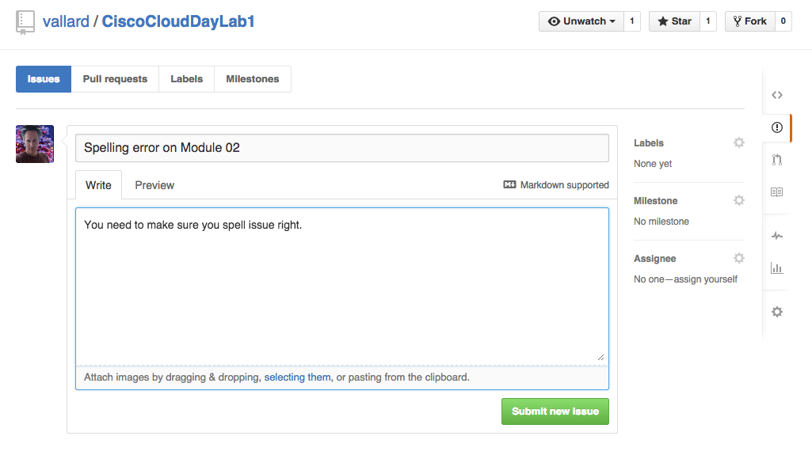
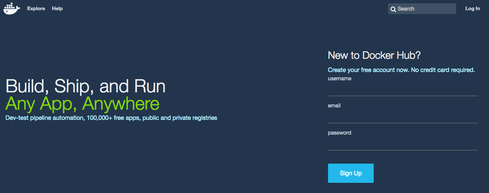

# Module 2: Revision Control (Git) and Containers (Docker)

* [2\.1 Git](#21-git)
  * [2\.1\.1 Sign up for Github](#211-sign-up-for-github)
  * [2\.1\.2 Create your own project](#212-create-your-own-project)
  * [2\.1\.3 Working with Git](#213-working-with-git)
  * [2\.1\.4 Branches with Git](#214-branches-with-git)
  * [2\.1\.5 Open an Issue](#215-open-an-issue)
  * [2\.1\.6 Fork a repository](#216-clone-a-repository)
  * [2\.1\.7 Pull Requests](#217-pull-requests)
* [2\.2 Docker](#22-docker)
  * [2\.2\.1 Searching Containers](#221-searching-containers)
  * [2\.2\.2 Downloading Docker Images](#222-downloading-docker-images)
  * [2\.2\.3 Starting Docker Images](#223-starting-docker-images)
  * [2\.2\.4 Volumes, Environment Variables](#224-volumes-environment-variables)
  * [2\.2\.5 Building a basic Container](#225-building-a-basic-container)
* [2\.3 (Optional) Setting Git and Docker on your own laptop](#23-optional-setting-git-and-docker-on-your-own-laptop)


In the last lab you learned about using APIs with Metapod. 

This module will introduce git and talk about branches, pull requests, etc. 
We will also talk about Docker Registries: Places to store your docker images

## 2.1 Git

_Git is a free and open source distributed version control system designed
to handle everything from small to very large projects with speed and
efficiency._

Version control systems have been around for years and there is more than just
git.  Git, however has some properties that make it very popular.  Primarily
its the ability to merge and branch changes that make it so effective.  While
you may think its something only used by developers, as we start to think of
"Infrastructure as Code" it makes sense that we maintain iterations of our
infrastructure in a convenient place.  Git provides this for us.  

What else can be stored in git?  All kinds of things!  Presentations, websites, 
resumes, etc. 

### 2.1.1 Sign up for Github

While git is free and opensource, Github is a company that stores github repositories
for you.  You can make as many repositories as you want in Github for free but 
they are publicly available.  So never store sensative things like passwords or 
account information on it.  

If you do not have an account, [sign up for Github now](http://github.com). There
is no cost to sign up for free.  

When selecting your email, you may want to use a personal email instead of a Cisco
email.  When selecting passwords, keep this in mind. 


### 2.1.2 Create your own project

Once logged into Github, click the '+ New repository' button on the right hand side. 



* Repository Name: cloudtest
* Description: Some awesome description
* Public: Github repositories are public by default.  Private repos cost money. 
* Initialize with a README is checked
* Add a license: Select the apache 2 license.  

Licenses are plentiful in software.  You're even allowed to make your own but the 
Apache2 is widely recognized and if someone wants to use your code they may ask
you to put this license in.  

Once you are complete, select __Create Repository__ and you'll be directed to the
repo.  



### 2.1.3 Working with Git

Now that we have the repository we are going to start working with it.  Let's first
download the repo, or 'clone' it. 

Inside the lab machine run the command: 

```
git clone <your repo>
```
Where ```<your repo>``` is the clone URL shown on the right side of the web page.  You can 
click on the clipboard to do this.  

As an example, if you wanted to get Vallard's cloudtest repo you would run:

```
git clone https://github.com/vallard/cloudtest.git
```
this will create a directory called cloudtest.  

Typically people will have a directory where all code lives.  For example if you have a 
Mac you might have a directory called ```~/Code``` and change to that directory before 
you ever run ```git clone``` commands.  

#### Make changes ####
```
cd cloudtest
```
Here we can edit the README.md file.  The 'md' in this case stands for markdown.  
Markdown is a formatting language that is supposed to be more simple than 
markup languages like HTML.  The syntax for Markdown files can be found
[here](http://daringfireball.net/projects/markdown/syntax).  This lab in fact
was written in markdown.  

Let's edit the ```README.md``` file by opening it with ```vim``` or ```pico```.  

Upon opening it, we can see that it looks as follows: 

```
# cloudtest
This is a test project
```

Make some edits so that the file is different, either by adding a line, or
changing the description line.  Then save and close the file.  

Once saved run: 
```
git status
```
You'll see that git is tracking that this file has been changed but the 
changes have not been committed.  Now commit the changes: 
```
git commit -am "made a change"
```
The 'made a change' preceeded by the ```-m``` flag gives the message of the commit
so others can see what the general idea of your change was.  
The ```-a``` flag signifies to commit all changed files. 

So far all the changes have been made locally, but if we look at 
github, nothing has changed upstream.  We will need to commit these changes to
the master.  This is done by running: 
```
git push
```
You will be prompted for your Github user account and password.  Once you enter this
changes will be pushed upstream. If two or more developers were working on the same
code then the other developer would need to run ```git pull``` while in his local
repo to sync to the latest changes. 

Let's add another file to this local directory.  
```
vim foo.txt
```
Add some text to the foo.txt file then save the file and close it.  Then run:
```
git status
```
Git tells us there is an untracked file.  We can add this file: 
```
git add -A
```
The ```-A``` tells git to add all untracked files recursively.  After adding the
file we need to commit it, so we again run: 
```
git commit -am "Added the foo.txt file for pleasure"
```
Finally, we can push this file again and see it show up in Github:
```
git push
```
This time, git remembers your login password so you don't have to enter it twice.  
Run
```
git log
```
To see the history of this repository. 

At this point with Git, if you are working on your own, this is really all the
commands you need to know. If you delete files, you just need to commit and the files
will be deleted.  

_IMPORTANT: One of the common problems people have is pushing passwords to Git repos. 
Even if you delete the file after its been committed and pushed, that password will
still exist on the internet._

### 2.1.4 Branches with Git

Branching is the idea that we make a copy of the existing repo to make changes. 
We then may decide to merge a branch back into the main code or just disgard the
changes.  Let's create a branch of our existing code

```
git branch twig
```
Now we can see all the branches in this repository by running:
```
git branch
```
To work in the branch we'll check out this new branch
```
git checkout twig
```
Add remove the ```foo.txt``` file and then commit the changes:
```
git 'rm *.txt'
git commit -am "Removed the text file"
```
Now let's go back to the master branch:
```
git checkout master
```
the twig foo.txt file exists still.  But when we merge the brancheds:
```
git merge twig
```
The foo.txt file is gone and we are on the master branch and those changes
have been made. 
Now we can get rid of the ```twig``` branch
```
git branch -d twig
```
Once again we can push the changes upstream using 
```
git push
```

### 2.1.5 Open an Issue
How can thousands of developers work asyncronously on the same code stream?
Git solves many of these issues through branches, commits, etc to keep 
developers in sync.  If you think about the fact that many developers on 
big open source projects have never met in real life yet manage to get things
done without meetings it is quite remarkable.  

In this section we'll talk about what happens if you find a problem with 
code you're working on.  It starts with opening an issue.  
Open your browser to [This Repo's issues](https://github.com/vallard/CiscoCloudDayLab1/issues). 

Here you see the lab that you are working on right now. Create a new issue
with this repo.  You may not like the grammar, or you may find a spelling error,
or you may have found something you wanted clarified.  
Create a new issue by clicking the green new isue button.  



These issues can be tracked and developers comment on the code and changes that may 
be desired.  Some issues can [get quite heated](https://github.com/karma-runner/karma/issues/376). 
[other example](https://github.com/twbs/bootstrap/issues/3057) as many people have different opinions. 

### 2.1.6 Fork a repository

After opening up issues, people might just say: "Yes, you're right someone should
fix that, so maybe you can.".  If you want to go about fixing issues to solve 
your own problems github allows you to do this.  

In addition, you may have philisophical disagreements with the project and wish
to create your own project from this.  This is what happened to bitcoin in summer
2015.  A subset if developers thought that the blockchain should be modified
to allow for more transactions per block.  
[More info on this debate can be read here](https://medium.com/faith-and-future/why-is-bitcoin-forking-d647312d22c1)

The first step in both of these use cases is to fork the code.  Then you make
changes to your local forked repo.  If you want this code to then go back
into the mainstream, you simply do a pull request.  Let's make a fork of 
this project. 

Navigate to this [Cloud Lab](https://github.com/vallard/CiscoCloudDayLab1)

Click the Fork button at the top right hand of the screen and fork this into your own 
github repo. 


You'll now have your own copy of the entire lab including all the images,
scripts, and documentation.  

Clone the new repo unto your workstation using the git clone command:
```
git clone https://github.com/<your username>/CiscoCloudDayLab1.git
```
Now that you have the repo, let's make a change.  We'll sign the guestbook:

```
cd CiscoCloudDayLab1/Users
echo "<your name> was here!" >> README.md
```
where ```<your name>``` is your git user ID.  

When complete, commit and push the code changes: 

``` 
git commit -am "Added my username to the list of users"
git push
```

### 2.1.7 Pull Requests 

In the previous exercise you forked a repo, then you made a change
then you committed and pushed the code back into your repo.  

Your repo exists as your own, but now you may want these changes to
go back into the core project. This can be done by issuing a pull 
request.  

Navigating back to your own repository web page pull requests you will 
see a pull request icon on the right hand side. 


Click on this and then you can create a new Pull request by clicking
on the Green button.  

You'll then see a screen that has the changes you made.  Github
allows you to tie these pull requests to issues.  

Something we didn't cover is that if someone has an issue against
your code, you can close it with a checkin with a message that
says something like "close issue #361".  More info on this
is [here.](https://help.github.com/articles/closing-issues-via-commit-messages/)

You can also close issues with pull requests by putting comments
in the pull request. 

Let the instructor know when you have created your pull request.  
He/She will already be notified by an email but just to make
sure it works in real time, let them know. 

Once the instructor approves the pull request you will see your
code updated on the [core project page.](https://github.com/vallard/CiscoCloudDayLab1/tree/master/Users) 

## 2.2 Docker

Docker containers are one of the hottest trends to hit application developers and 
IT administrators in the last several months.  Docker really became usable in 
mid 2014 but is still relatively young.  In this section we are going to run several
exercises to get familiar with containers.  

### 2.2.1 Searching Containers

On the lab workstation run the commands: 
```
sudo docker search python
sudo docker search nginx
sudo docker search rails
```

(Password is the same as your user account: ```Cisco.123```)

This will show a list of docker containers you can download and use.   
You can also search by visiting the [Docker Hub](https://hub.docker.com)
With your web browser, visit the [Docker Hub](https://hub.docker.com)
and search for another application of framework (Django, Wordpress, etc)
You don't need to log in and you can search via the search bar
on the top left.  



### 2.2.2 Downloading Docker Images

A quick way to get started with Docker is to download one of the smallest 
containers there is.  From the lab machine run: 
```
sudo docker run hello-world
```
This image will download (if it hasn't already) and run, flash a message
stating its working and then terminate.  

The docker ```pull``` command will download the image.  This will then 
be stored on your local host.  When you issue the ```docker run``` command
docker will look to see if the image is present and run it.  If the image
is not present, it will download it and then run it.  

### 2.2.3 Starting Docker Images

Let's try running a webserver.  Nginx is a good webserver to start
with.  From your lab machine run the command:
```
sudo docker run --rm -it -p 80<user #>:80 --name nginx<user #> nginx
```
where ```<user #>``` is the number of your account.  
E.g.: user03 would run the command:
```
sudo docker run --rm -it -p 8003:80 --name nginx03 nginx
```

This will run an interactive container on which you will be logged in.  
The ```--rm``` flag tells docker to remove the container when it's done
running. 

The ```-it``` is actually two flags:  The ```-i``` for interactive and
the ```-t``` for creating a terminal.  

The ```-p 80<user #>:80``` tells docker to map port 80 of the container
to the host port ```80<user #>```.  


You can now start nginx up by running:
```
service nginx start
```
Try opening a web page to this service from your browser: ```http://<labip>:80<user #>```

When you have finished verifying that your webserver is up, go back to the terminal
and type ```exit``` to exit the running container.  

When debugging containers we often run interactive containers like we just did.  But 
when we run in production, we run them without logging into them.  Docker has a 
```-d``` flag for this.  Containers will sometimes have a default command to run when
they start up.  In the case of the nginx container, it by default will run the
nginx websever.  Let's rerun our container in daemon mode by running the command: 

```
sudo docker run -d -p 8003:80 --name nginx03 nginx
```
This will start up the container and again you should be able to access it through your
same web browser URL. 

We stop containers by stopping them either via the name, or the id.  By default if you
do not give a container a name, then it will randomly generate a name.  Run the command

```
sudo docker ps
```
This will show you all of the running containers.  You may see other people's 
containers running as well.  Please be kind, and don't clobber their stuff.  

To stop your container we run:
```
sudo docker stop nginx<user #>
```
Now to see all of the containers, including the stopped containers you run: 
```
sudo docker ps -a
```
This will show all the containers that are there.  We can remove your container 
(not the image) by running: 
```
sudo docker rm nginx<user #>
```
You could also remove the hello-world image by running ```docker rmi hello-world```.
If there are people running it then you won't be able to remove it until the containers
are stopped and cleared.  Its important to distinguish between a container and a 
container image.  A container image is just a running image.  The docker
command is used to manage both of them. 

### 2.2.4 Volumes, Environment Variables

Even though we talk a lot about stateless services the state must exist somewhere even 
if it isn't tied specifically to the instance or container that runs.  Volumes are how
we keep state in Docker containers.  

Let's get a real web service up by making our own webpage and have the state displayed. 
On your lab workstation run the command: 
```
mkdir ~/html/
cd ~/html
wget https://raw.githubusercontent.com/vallard/CiscoCloudDayLab1/master/02-GitAndRegistries/html/index.html
sudo docker run -d -v `pwd`:/usr/share/nginx/html -p 80<user #>:80 --name nginx<user #> nginx
```

The ```-v``` flag will mount a volume, specifically our current working directory, which has our 
newly grabbed ```index.html```.  Things in this volume will persist.  While a webpage
shows reading to it, some containers will instead write data to volumes.  By mounting
with the -v we ensure they persist.  That way if the container goes away, our 
information will remain.  

This is better demonstrated with a database as those persist across reboots. 
In the [gist shown here](https://gist.github.com/vallard/5a7bcebb912e673ed60a#gitlab-example)
you can see an example of how we created the gitlab container that uses
a Postgres database.  The Postgres database mounts a volume (in this case
```/opt/postgresql/data``` so that if the container is deleted, the data
will persist.  This is analogous to how in openstack we mount persistent
volumes to instances.  

Stop your running container so that you are ready for the next exercise:
```
sudo docker stop nginx<user #>
sudo docker rm nginx<user #>
```

#### Environment Variables

The other examples you'll see in running containers are passing environment
variables to the containers.  These environment variables can be 
parsed and ran by the script that first runs when the container
launches.  

The [Gitlab example](https://gist.github.com/vallard/5a7bcebb912e673ed60a#gitlab-example)
shows the database passwords and users that are sent when the postgres
container first launches.  

### 2.2.5 Building a basic Container

At this point we've been using containers that have been built by other people. 
There are various ways you can get an image baked the way you want it:

* You can take an existing image, make the changes, (like install packages) and 
then run ```docker commit``` to save it.  
* You can take a vanilla container, launch it and then customize it with things 
like Ansible.  
* You can create a Dockerfile and build it that way.  

The first two approaches are not recommended for several reasons.  

* Using ```docker commit``` gives you a blackbox from which no one will be able
to reproduce.  This makes for bad infrastructure and doesn't adhere to the 
'infrastructure as code' paradigm so many people are anxious to adopt.  

* Using Ansible, Chef, Puppet, etc to update and make images in a usable state
is also bad because it doesn't allow people to adopt an 'immutable infrastructure'
design.  [Immutable infrastructure](http://chadfowler.com/blog/2013/06/23/immutable-deployments/)
is described brilliantly in the previous link is not new, but many things like
docker have made it possible to adopt it in the enterprise. 

Let's now build a basic docker container using a Dockerfile.  

Using your text editor create a new file called ```Dockerfile``` in your
current directory. (should be the html directory from the last exercise)
```
vim Dockerfile
```
Inside this file let's past the following into this file:
```
FROM nginx
MAINTAINER FirstName LastName "youremail@yourdomain.com"
ADD index /usr/share/nginx/html
```

Save this file and close it.  Now we can build this image. 

```
sudo docker build -t <yourname>/staticweb .
```
where ```<yourname>``` can be your docker hub account (if you have one) or 
any old name if you don't wish to create one. 

This will build a brand new container based on nginx that you can now run.  
All of the properties in the previous nginx container will be used. 

Let's run and test this new container:
```
sudo docker run -d -p 80<user #>:80 --name=<yourname> <yourname>/staticweb
```

Once again you should be able to access your container with its static 
website that you created.  Congratulations!  You built your first 
container.  

#### (Optional) Upload to the Docker Hub

You can upload this image to dockerhub.  First, go visit 
[DockerHub](https://hub.docker.com) and sign up for an account.  Once
this is done, return back to your lab workstation and run the command: 

```
sudo docker push <yourname>/staticweb
```
It will ask you for your login credentials and will upload it.  Note that
the <yourname> must match your docker user ID.  If you didn't do that
then change the name of your image to match your docker user ID by running
the docker tag command:
```
sudo docker tag <originalname>/staticweb <newname>/staticweb
```
Then you can redo the ```docker push``` command above. 


## 2.3 (Optional) Setting Git and Docker on your own laptop

[Download and install the Docker Toolbox](https://www.docker.com/toolbox)
