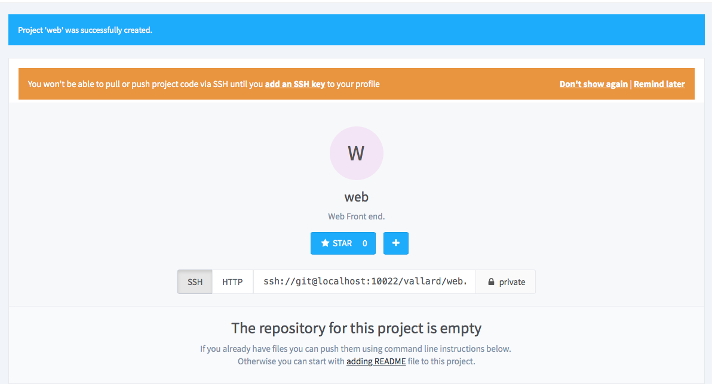

# Module 3: Continous Integration
[Home](https://github.com/vallard/CiscoCloudDayLab1)

The first two modules got us working with APIs, Git, and Docker.  In this module
we will tie all of it together with some helpful bots.  In this case
our bot will be [Jenkins](https://jenkins-ci.org).  

We're going to create a fun website.  This website will be front-ended with a
load balancer that will then direct traffic to some of our instances.  

When ever we push new code, our robot will take the code out of gitlab run
some tests, and then push the new code into production.  

## 3.1 Configure Gitlab

Create a new account on Gitlab.  The instructor will give you the URL
of where to sign in to create this account.  The account name can be
anything you like (your name, CEC, etc). 


Enter a random password.  Let the administrator know that you have created
the account.  They will then confirm your account so that you can login
without having to check your email.  

Once they have notified you that your account has been confirmed, log into
gitlab.  


### 3.1.1 Initial project creation

After logging in you will create a new project so that you can upload code
to this source control repository. 

Create a new project by clicking the green _New Project_ button. Call it _web_


You can leave all the default settings and give it a brief description. 


Once this is created, you'll get an error message that shows you that you
can't push or pull code because you haven't entered any SSH keys.  



### 3.1.2 Setup SSH keys

On the left menu, click on the _Profile Settings_ 


The side menu changes and you should see the _SSH Keys_ menu item in the 
sidebar.  Click on it. 

Click the green button to add an SSH key. We'll come back to this screen
after completing the next step. 

#### 3.1.2.1 Generate SSH key

log back into the lab machine and generate a new SSH key to be used by 
this lab user. Run the command:

```
ssh-keygen -t rsa
```
and just hit the 'enter' button at all the questions.  

This will create two keys inside your ```~/.ssh``` directory.  One key is
the public key ```id_rsa.pub``` and the other key ```id_rsa``` is your 
private key.  We are going to paste the contents of the ```id_rsa.pub```
key to the Gitlab web page we have open now. 

```
cat ~/.ssh/id_rsa.pub
ssh-rsa AAAAB3NzaC1yc2EAAAADAQABAAABAQDGEhfKSB+jkR/+0oEH5o+x8DHw9VpZi3zSK28+dVf1coatgQXh5pNg2V/lhN8L1D1N5pJUPftt0MWVXlzRvmzOfhmQ5MMrS+ICWUdeKmGpFZOI/kCZRwbJraDbcwPoevlfyPPEOSg8soeKrLXMPqXAYHE06eF7FK2m9XcvJbtO1P+bFq6YCBh8zDd69xsWtB2GuQwZ2rDy4rPaqFO667NHUzJTiR0mJxiB91xg8UTHRRCjpXluFyeF6i1uz/qaa7pDwlxoLvg5sHfR4M6emYQ9UOY3IQH35gF2Co6k6uaAgDCCWBmcSCIIpTyPrUHtKbKmgfHdmQBehUQ5iCneczpr user06@7dcd05b736f8
```
Copy and paste this into the browser.  

#### 3.1.2.2 Install SSH key into Gitlab


Clicking 'Add Key' should save the key into your account.

## 3.1.3 Clone Repository

From the left side menu select _Back to dashboard_

## 3.2 Configure Jenkins


